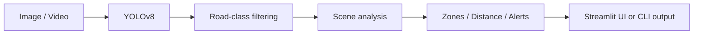

# 🚗 Intelligent Road Scene Understanding with YOLOv8

Real-time road-scene object detection and scene understanding using YOLOv8, with a Streamlit web UI and CLI tools for image/video inference, evaluation, and fine-tuning.

## Features

- Detects road-related classes such as cars, buses, trucks, people, cyclists, traffic lights, and stop signs.
- Rule-based scene understanding: left / ahead / right, near / far, and hazard alerts.
- Image and video inference with annotated outputs.
- Streamlit web application.
- CLI scripts for inference, evaluation, and training.
- Unit tests and GitHub Actions CI.

## Project structure

```text
road-scene-yolo/
├── app.py
├── road_scene/
│   ├── config.py
│   ├── detector.py
│   ├── scene.py
│   ├── schema.py
│   └── video.py
├── scripts/
│   ├── run_image.py
│   ├── run_video.py
│   ├── evaluate.py
│   ├── train.py
│   └── make_assets.py
├── notebooks/
├── tests/
├── assets/
├── docs/
├── requirements.txt
└── LICENSE
```

## Quick start

```bash
git clone https://github.com/Praveen5722/road-scene-yolo.git
cd road-scene-yolo
python -m venv .venv
source .venv/bin/activate       # Windows: .venv\\Scripts\\activate
pip install -r requirements.txt
```

### Streamlit app

```bash
streamlit run app.py
```

YOLO weights such as `yolov8n.pt` are downloaded automatically by Ultralytics when first used and are intentionally excluded from Git.

### Image inference

```bash
python scripts/run_image.py --input assets/sample_street.jpg --output annotated.jpg --zones
```

### Video inference

```bash
python scripts/run_video.py --input road.mp4 --output annotated.mp4 --unique
```

### Evaluation

```bash
python scripts/evaluate.py --data coco8.yaml
```

### Training

The repository contains the training pipeline, but the original ZIP does **not** contain a complete annotated YOLO training dataset. Supply your own dataset and `data.yaml` before training:

```bash
python scripts/train.py --data data.yaml --epochs 50 --imgsz 640
```

A typical YOLO dataset is:

```text
dataset/
├── images/
│   ├── train/
│   └── val/
├── labels/
│   ├── train/
│   └── val/
└── data.yaml
```

## Testing

```bash
pytest -q
```

The scene-logic tests run offline. The detector integration test skips automatically when model weights are unavailable.

## Architecture



## Limitations

Distance is estimated from image geometry rather than a depth sensor. This is an educational prototype and is **not a safety-critical driving system**.

## License

This project is released under the MIT License. See `LICENSE`.

Ultralytics YOLO has its own licensing terms; review the applicable Ultralytics license before commercial distribution.

## Credits

Built with Python, Ultralytics YOLO, OpenCV, NumPy, Pandas, Matplotlib, and Streamlit.
